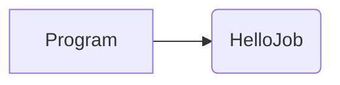
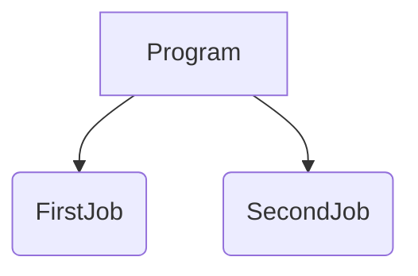
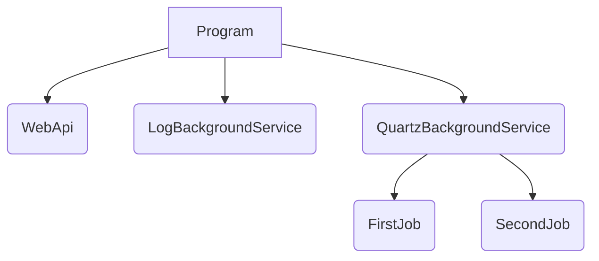

# JobScheduling

An example repository for job scheduling in C#.

## Directory

1. **JobScheduling.Common**: Common shared codes
1. **JobScheduling.Simplest**: Simplest scheduling on Quartz
1. **JobScheduling.DependencyInjection**: Using Quartz with dependency Injection
1. **JobScheduling.WebApiExample**: Using Quartz, background job and WebApi
1. **JobScheduling.HangfireApp**: Simplest scheduling on Hangfire

## Details

### JobScheduling.Simplest

This example is just a console app that has 1 Quartz job called `HelloJob`.



### JobScheduling.DependencyInjection

This example includes two Quartz jobs running on different Cron schedule using dependency injection technique.



### JobScheduling.WebApiExample

This example illustrates running a WebAPI project alongside with background service and Quartz Cron Jobs.



Example of the logs in the console:

```log
Logging from LogBackgroundService - ExecuteAsync - 09/16/2024 08:42:14 - 0 0/1 * 1/1 * ? *
info: Microsoft.Hosting.Lifetime[14]
      Now listening on: https://localhost:7042
info: Microsoft.Hosting.Lifetime[14]
      Now listening on: http://localhost:5281
info: Microsoft.Hosting.Lifetime[0]
      Application started. Press Ctrl+C to shut down.
info: Microsoft.Hosting.Lifetime[0]
      Hosting environment: Development
info: Microsoft.Hosting.Lifetime[0]
      Content root path: D:\Workspace\Visual Studio\JobScheduling\JobScheduling.WebApiExample
info: JobScheduling.WebApiExample.Controllers.WeatherForecastController[0]
      Get weather called
Logging from LogBackgroundService - ExecuteAsync - 09/16/2024 08:42:24 - 0 0/1 * 1/1 * ? *
Logging from LogBackgroundService - ExecuteAsync - 09/16/2024 08:42:34 - 0 0/1 * 1/1 * ? *
Logging from LogBackgroundService - ExecuteAsync - 09/16/2024 08:42:44 - 0 0/1 * 1/1 * ? *
Logging from LogBackgroundService - ExecuteAsync - 09/16/2024 08:42:54 - 0 0/1 * 1/1 * ? *
Executing Second Job: 09/16/2024 08:43:00
Executing First Job: 09/16/2024 08:43:00
Logging from LogBackgroundService - ExecuteAsync - 09/16/2024 08:43:04 - 0 0/1 * 1/1 * ? *
Logging from LogBackgroundService - ExecuteAsync - 09/16/2024 08:43:14 - 0 0/1 * 1/1 * ? *
Logging from LogBackgroundService - ExecuteAsync - 09/16/2024 08:43:24 - 0 0/1 * 1/1 * ? *
Logging from LogBackgroundService - ExecuteAsync - 09/16/2024 08:43:34 - 0 0/1 * 1/1 * ? *
Logging from LogBackgroundService - ExecuteAsync - 09/16/2024 08:43:44 - 0 0/1 * 1/1 * ? *
Logging from LogBackgroundService - ExecuteAsync - 09/16/2024 08:43:54 - 0 0/1 * 1/1 * ? *
Executing First Job: 09/16/2024 08:44:00
Executing Second Job: 09/16/2024 08:44:00
Logging from LogBackgroundService - ExecuteAsync - 09/16/2024 08:44:04 - 0 0/1 * 1/1 * ? *
```

## Resources

- [Quartz.NET](https://www.quartz-scheduler.net/)
- [Cron Expression Generator & Explainer - Quartz](https://www.freeformatter.com/cron-expression-generator-quartz.html)
- [Hangfire](https://www.hangfire.io/)
- [CronMaker](http://www.cronmaker.com/)
- [Crontab.guru](https://crontab.guru/): Linux standard. Not applicable for Quartz
- [The Only .NET Scheduler You Should Be Using!](https://www.youtube.com/watch?v=4wURs-67mB0)
